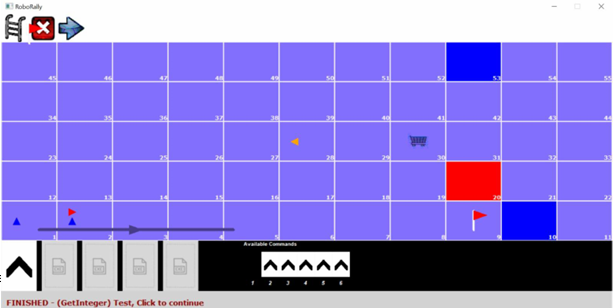

# Robo Rally - CMPS102 Programming Techniques Project

 <!-- Add a screenshot if available -->

A strategic robot racing game implemented in C++ with strict object-oriented design principles, developed for Cairo University's CMPS102 course.

## 📜 Project Description

Robo Rally is a turn-based strategy game where two players program their robots to navigate through a dangerous factory floor filled with obstacles and special tiles. The first player to reach the flag wins!

### Key Features:
- **Dual Game Modes**:
  - 🛠️ **Design Mode**: Create custom game boards with various interactive elements
  - 🎮 **Play Mode**: Compete against another player in strategic robot battles
- **12+ Game Objects**:
  - Belts, Rotating Gears, Workshops
  - Water Pits (instant elimination)
  - Danger Zones (health reduction)
  - Flags (win condition)
  - Antennas (turn order control)
- **Advanced Game Mechanics**:
  - Command programming system
  - Laser shooting phase
  - Workshop upgrades and consumables
  - Special devices (Shield, Extended Memory, etc.)

## 🏗️ Project Structure
```
 RoboRally/
├── CMUgraphicsLib/ # Graphics library
├── images/ # Game assets
├── Actions/ # All game actions (30+ actions)
│ ├── DesignMode/ # Design mode actions
│ └── PlayMode/ # Play mode actions
├── GameObjects/ # All game objects
├── Core/ # Core game classes
│ ├── ApplicationManager.cpp/h
│ ├── Grid.cpp/h
│ ├── Cell.cpp/h
│ └── CellPosition.cpp/h
├── Players/ # Player-related classes
├── GUI/ # Input/Output handling
│ ├── Input.cpp/h
│ └── Output.cpp/h
├── DEFS.h # Global definitions
├── UI_Info.h # UI constants
└── Main.cpp # Entry point
```

## 🚀 Getting Started

### Prerequisites
- Visual Studio (project files included)
- CMU graphics library (included)

### Building and Running
1. Clone the repository:
   ```bash
   git clone https://github.com/Ahmedattay/RoboRally.git
   Open PT-Project.sln in Visual Studio

2. Build the solution (F7)

3. Run the executable (F5)
## 🎮 Game Controls
### Design Mode:
- Add Objects: Click toolbar icons then click grid cells
- Copy/Cut/Paste: Select object then destination
- Save/Load: Use file dialog to manage grids
- Switch to Play Mode: Click the play icon

### Play Mode:
- Select Commands: Choose from available movement options
- Execute Commands: Run programmed sequence
- Use Items: Activate consumables from workshops
- Shooting Phase: Automatic after movement
##  📚 Documentation
Full project requirements and specifications available in:

- [CMPS102-Project-Fall2024-Phase1.pdf](https://drive.google.com/file/d/16_kp0VrN1SX1CExWSBjKzMtknCui9St0/view?usp=sharing)
- [CMPS102-Project-Fall2024-Phase2.pdf](https://drive.google.com/file/d/1SzBFhviDbPYZ0f9ZgZnPAQ_RLaCj5_-Z/view?usp=sharing)
 ## 👤 Author  
📌 **Ahmed Attay**  
🔗 [LinkedIn Profile](https://www.linkedin.com/in/ahmed-attay-173888252/)  
## 📜 License  
This project is open-source and free to use under the **MIT License**.  
